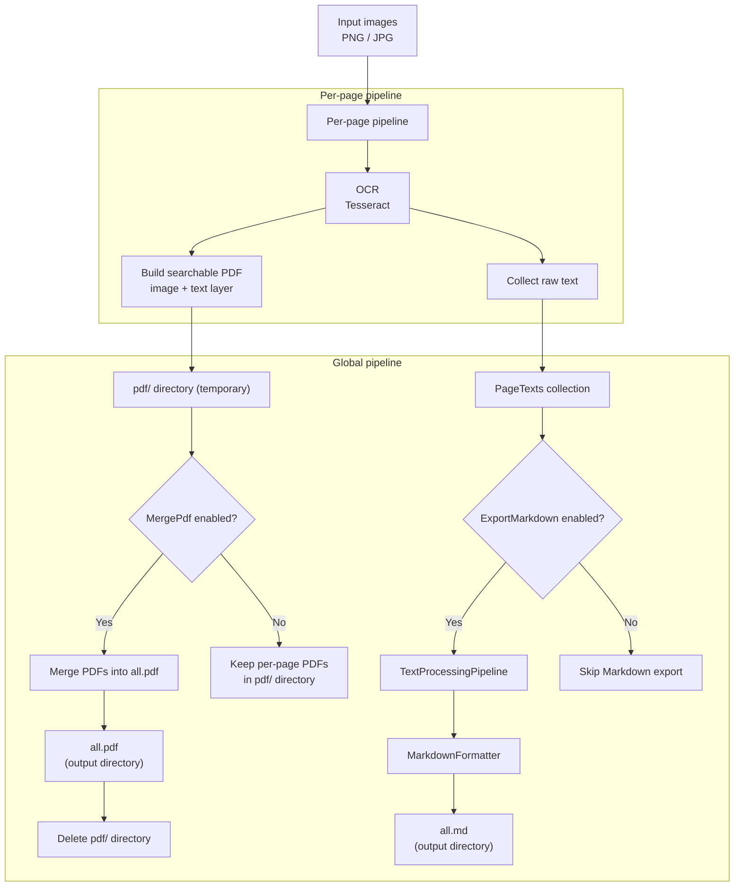

# OcrFlow

**OcrFlow** is a lightweight, offline-first OCR pipeline for converting scanned images into searchable PDFs and structured Markdown.

## Usage (Windows)

### First run (required)

After downloading and extracting the release, unblock files (unsigned binaries):

```powershell
Get-ChildItem . -Recurse | Unblock-File
```

---

### Basic usage

```powershell
.\OcrFlow.exe "<INPUT_PATH>"
```

* `<INPUT_PATH>` – folder containing PNG / JPG / PDF files
* default behavior: **merge enabled**
* output: `output.pdf` created in the input directory

---

### Options

#### Merge (default)

```powershell
.\OcrFlow.exe "<INPUT_PATH>" --merge
```

Scales all detected pages into a single PDF file.

#### Disable merge

```powershell
.\OcrFlow.exe "<INPUT_PATH>" --no-merge
```

Generates separate PDF files instead of a single merged output.

---

### Example

```powershell
.\OcrFlow.exe "C:\Users\{user}\Scans\png"
```




The project is built around a **two-level pipeline architecture**:

* **Per-page pipeline** – OCR → PDF → text collection
* **Global pipeline** – merge, post-processing, export

Each step is explicit, composable, and independently testable.

---

## Key features

* 🧠 **Offline OCR** powered by Tesseract (no cloud, no telemetry)
* 📄 **Searchable PDF output** (image + invisible text layer)
* 📝 **Markdown export** with OCR-aware normalization
* 🔗 **Pipeline-based design** (Chain of Responsibility)
* ⚙️ **Config-driven execution** (enable/disable steps like merge or spell correction)
* 🧪 Deterministic output – no AI guessing, no hidden heuristics

---

## Architecture overview

OcrFlow intentionally avoids monolithic processing. Instead, it uses two independent but connected pipelines:

### 1. Per-page pipeline

Executed once per input image:

* OCR (Tesseract)
* PDF generation (image + text layer)
* Text collection for later processing

Each step processes **exactly one page** and has **no internal loops**.

### 2. Global pipeline

Executed once after all pages are processed:

* PDF merge (optional)
* Text post-processing
* Markdown generation (`all.md`, `all.corrected.md`)
* Cleanup

This separation keeps responsibilities clear and avoids hidden coupling.

---

## Design goals

* **Offline-first** – no external services
* **Predictable output** – rule-based post-processing
* **Explicit control flow** – no magic, no background behavior
* **Low complexity** – no heavy frameworks or runtime DI
* **Easy extensibility** – add/remove pipeline steps without refactoring core logic

---

## Typical use cases

* Archival scanning
* Technical and construction documentation
* Engineering project records
* Offline document processing pipelines

---

## Philosophy

OcrFlow focuses on *engineering correctness* rather than convenience shortcuts:

* OCR errors are handled with deterministic rules, not AI guessing
* Text normalization is explicit and testable
* Each pipeline step does exactly one thing

If you need full control over OCR, layout, and post-processing — **OcrFlow is designed for you**.

---

## License

MIT (or your preferred license)
