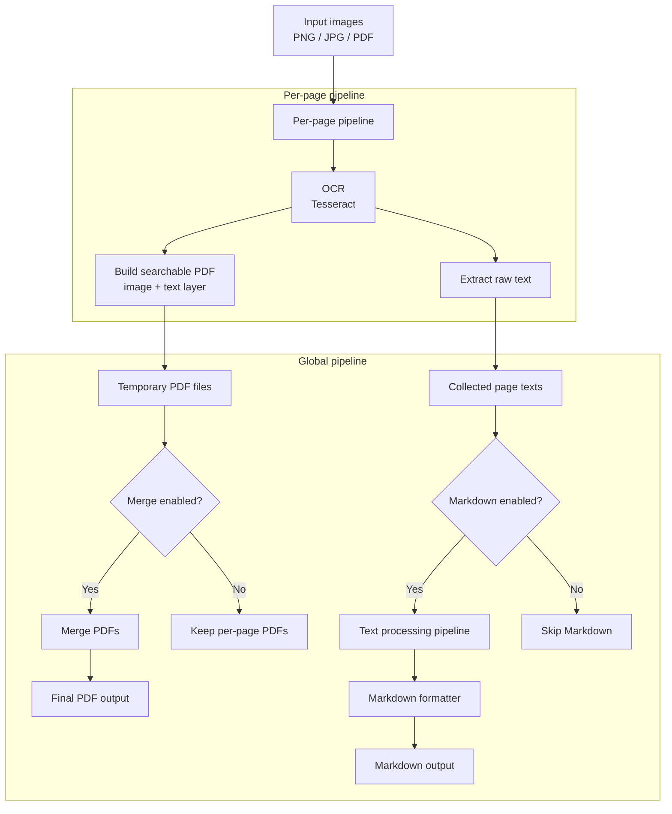

# OcrFlow

**OcrFlow** is a lightweight, offline-first OCR pipeline for converting scanned images into searchable PDFs and structured Markdown.

---

## Usage (Windows)

### First run (required)

After downloading and extracting the release, unblock files (unsigned binaries):

```powershell
Get-ChildItem . -Recurse | Unblock-File
```

---

## Basic usage

```powershell
.\OcrFlow.exe "<INPUT_DIR>"
```

* `<INPUT_DIR>` – directory containing images (PNG / JPG / PDF)
* default behavior:

  * PDF generation enabled
  * merge enabled
  * Markdown enabled
  * result summary enabled
* output files are created in the input directory (unless `--outputdir` is used)

You can also pass input directory explicitly:

```powershell
.\OcrFlow.exe --source "<INPUT_DIR>"
```

---

## Options

### Input directory

```powershell
.\OcrFlow.exe "<INPUT_DIR>"
.\OcrFlow.exe --source "<INPUT_DIR>"
```

* positional argument or `--source <DIR>`
* directory must exist

---

### OCR language

```powershell
.\OcrFlow.exe "<INPUT_DIR>" --lang eng
```

* `--lang <LANG>` – OCR language(s), e.g. `eng`, `pol`, `eng+pol`
* default: `eng`

---

### PDF output

#### Default

PDFs are generated and merged into a single file.

#### Disable PDF generation

```powershell
.\OcrFlow.exe "<INPUT_DIR>" --nopdf
```

#### PDF only

```powershell
.\OcrFlow.exe "<INPUT_DIR>" --onlypdf
```

* Generates **only PDF**
* Skips Markdown generation

> `--nopdf` and `--onlypdf` cannot be used together

---

### Markdown output

#### Default

Markdown summary is generated automatically.

#### Disable Markdown

```powershell
.\OcrFlow.exe "<INPUT_DIR>" --nomarkdown
```

#### Markdown only

```powershell
.\OcrFlow.exe "<INPUT_DIR>" --onlymarkdown
```

* Generates **only Markdown**
* Skips all PDF generation
* Slightly faster for large batches

> `--nomarkdown` and `--onlymarkdown` cannot be used together

---

### Merge control

#### Default (merge enabled)

```powershell
.\OcrFlow.exe "<INPUT_DIR>"
```

All pages are merged into a single PDF.

#### Disable merge

```powershell
.\OcrFlow.exe "<INPUT_DIR>" --nomerge
```

* Generates separate PDFs (one per page)

---

### Output directory

```powershell
.\OcrFlow.exe "<INPUT_DIR>" --outputdir "C:\Output"
```

* Overrides default output location
* Input directory remains unchanged

---

### Output file name prefixes

```powershell
.\OcrFlow.exe "<INPUT_DIR>" --pdf-name-prefix scan_ --md-name-prefix text_
```

* `--pdf-name-prefix` – prefix for generated PDF files
* `--md-name-prefix` – prefix for generated Markdown files

---

### Result summary file

By default, OcrFlow generates a result summary file:

```
result-YYYY-MM-DD_HH-mm.md
```

Disable it with:

```powershell
.\OcrFlow.exe "<INPUT_DIR>" --noresult
```

---

### Debug / testing (DEBUG builds only)

```powershell
.\OcrFlow.exe "<INPUT_DIR>" --throw
```

Forces an exception to test crash handling and diagnostics.

---

## Example

```powershell
.\OcrFlow.exe "C:\Users\{user}\Scans" --lang pol --onlymarkdown --outputdir "C:\Output"
```

---

## Processing pipeline



---

## Architecture

OcrFlow uses a **two-level pipeline architecture**:

### Per-page pipeline

Executed once per page:

* Image loading & normalization
* OCR (Tesseract)
* Searchable PDF generation
* Raw text extraction

### Global pipeline

Executed once per run:

* Optional PDF merge
* Text post-processing
* Optional Markdown export
* Optional result summary

Each step is explicit, composable, and independently testable.

---

## Key features

* Offline OCR (no cloud, no telemetry)
* Searchable PDF output
* Structured Markdown summaries
* Deterministic pipeline execution
* Fine-grained CLI control
* Clear separation of concerns

---

## Design goals

* Offline-first
* Predictable output
* Explicit control flow
* Low runtime complexity
* Easy extensibility

---

## Typical use cases

* Archival scanning
* Technical documentation
* Engineering records
* Offline document processing
